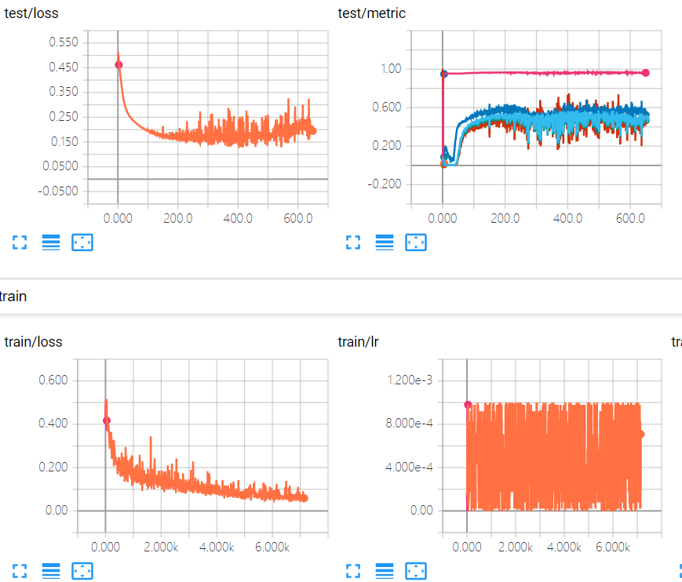

# Change Detection

一个用 PyTorch 编写的，专门针对变化检测 (Change Detection) 任务的模型框架。

[English](./.github/README_EN.md)

- [Change Detection](#change-detection)
  - [写在前面](#%e5%86%99%e5%9c%a8%e5%89%8d%e9%9d%a2)
    - [为什么写这个项目？](#%e4%b8%ba%e4%bb%80%e4%b9%88%e5%86%99%e8%bf%99%e4%b8%aa%e9%a1%b9%e7%9b%ae)
    - [特性](#%e7%89%b9%e6%80%a7)
  - [开始使用](#%e5%bc%80%e5%a7%8b%e4%bd%bf%e7%94%a8)
    - [0. 数据集](#0-%e6%95%b0%e6%8d%ae%e9%9b%86)
    - [1. 配置文件](#1-%e9%85%8d%e7%bd%ae%e6%96%87%e4%bb%b6)
    - [2. 训练](#2-%e8%ae%ad%e7%bb%83)
    - [3. 测试](#3-%e6%b5%8b%e8%af%95)
  - [使用你自己的模型/数据集/损失函数](#%e4%bd%bf%e7%94%a8%e4%bd%a0%e8%87%aa%e5%b7%b1%e7%9a%84%e6%a8%a1%e5%9e%8b%e6%95%b0%e6%8d%ae%e9%9b%86%e6%8d%9f%e5%a4%b1%e5%87%bd%e6%95%b0)
    - [模型](#%e6%a8%a1%e5%9e%8b)
    - [数据集](#%e6%95%b0%e6%8d%ae%e9%9b%86)
    - [损失函数](#%e6%8d%9f%e5%a4%b1%e5%87%bd%e6%95%b0)
  - [结果](#%e7%bb%93%e6%9e%9c)
  - [TODO](#todo)
  - [参考](#%e5%8f%82%e8%80%83)

## 写在前面

### 为什么写这个项目？

变化检测（Change Detection，CD）任务与其他任务，如语义分割，目标检测等相比，有其特有的特性（坑），如数据集少（少到可怜那种，尤其是异源，我**），公开的模型也很少，输入常常是成对的（导致一些在 PyTorch 中常用的函数，如Random系列等需要做出一些改变），给初学者带来了很大的困扰（对，没错就是我），所以我将毕设期间写的一些代码，仿照 [maskrcnn-benchmark](https://github.com/facebookresearch/maskrcnn-benchmark) 整理一下发布出来。

### 特性

- **边训练边测试（可选）**

  由于数据集数量较少，以及 CD 只是一个 “二分类” 问题，所以模型一般较为简单，因此边训练边测试可以更为方便的选到最优解（不增加显存）。

- **“模块式” 搭建模型，方便扩展**

  将整个过程从前期数据处理到后期测试拆分为独立的几个部分，方便之后搭建自己的模型、采用新型的优化器方法或者学习率策略以及增加新的数据集。

- **数据增强**

  将数据增强放在了 “dataloader” 部分，在传统 transform 的基础上实现了对 N 个图片同时操作，保证了 Random 系列图片的一致性，默认的数据增强方式:
  - 以概率 $p_1$ 随机水平翻转
  - 以概率 $p_2$ 随机垂直翻转
  - 以概率 $p_3$ 随机旋转任意角度

## 开始使用

下表是实现的可以直接用的一些模块（持续更新）

| model                      | dataset  | lr scheduler                                | loss                            | optimizer |
| -------------------------- | -------- | ------------------------------------------- | ------------------------------- | --------- |
| 1. siamese_unet_conc<br />2. siamese_unet_diff | 1. Szada | 1. WarmupMultiStepLR<br />2. WarmupCosineLR | 1. BCEWithLogitsLoss+pos_weight | 1. SGD    |

### 0. 数据集

将对应数据集下载并解压到 `data/`目录下

- [Szada]()

  取 7 对大小为 952\*640 的图像的左上角大小为 784\*448 的图片作为测试集，其余部分按照步进为 56 的滑动窗口划分为大小 112\*112 的图片，并以此作为训练集

### 1. 配置文件

按照 `configs/homo/szada_siamese_unet_conc.yaml` 的格式设置自己的配置文件，具体参数说明可以参考 [configs](.github/CONFIGS.md) 。

### 2. 训练

`-cfg` 指向你的配置文件

```bash
python train_net.py -cfg configs/homo/szada_siamese_unet_conc.yaml
```

（可选）打开 tensorboard 查看训练进度，取得满意的结果后可以停止训练
```bash
tensorboard --logdir=logs/tensorboard
```



### 3. 测试

`-cfg` 指向你的配置文件

```bash
python eval_net.py -cfg configs/homo/szada_siamese_unet_conc.yaml
```

## 使用你自己的模型/数据集/损失函数

### 模型
1. 将你的写好的模型文件 `MYMODEL.py`放在 `model/`下面（`layers`下面是一些封装好可以调用的层）
2. 在 `build/model.py` 里调用你的模型 `from model.MYMODEL import MODEL`
3. 在 `build/model.py` 中字典 `model_map` 添加你的模型和对应的 `KEY`
4. 修改你的配置文件中，`BUILD.MODEL.CHOICE:KEY`和其他选项

### 数据集
*`data/normal.py` 是针对一般数据集写好的 `dataloader` 文件，里面默认使用上面提到的数据增强对数据进行增强，要想取消数据增强（一些已经增强过的训练集），可以给 `Normal` 的参数 `data_trans` 传递普通的数据处理（如 `Normal._test_trans()`所示）。*

1. 将你的写好的加载数据的脚本 `DATALOADER.py`放在 `data/`下面
2. 在 `build/dataloader.py` 里调用你的模型 `from data.DATALOADER import DATALOADER`
3. 在 `build/dataloader.py` 中字典 `datasets_map` 添加你的脚本和对应的 `KEY`
4. 修改你的配置文件，`BUILD.DATALOADER.CHOICE:KEY`

### 损失函数
同上，放在一个文件夹中，然后引入，然后建立对应关系，最后修改配置文件。

## 结果

| Dataset | Method            | PCC  | Re   | F1   | Kappa | checkpoint                                                   |
| ------- | ----------------- | ---- | ---- | ---- | ----- | ------------------------------------------------------------ |
| Szada   | Siamese_unet_conc | 96.0 | 50.9 | 54.8 | 52.7  | [OneDrive](https://drive.google.com/open?id=17WsyAgMByZB-Rcl5BZiqhoGAlKjTqz1V) |
| Szada   | Siamese_unet_diff | 95.8 | 67.0 | 55.4 | 53.2  | [OneDrive](https://drive.google.com/open?id=1compOiumTmHTGYXkmTTKzfpEoPXL_JZj) |

（取 F1 最高值的 checkpoint 作为结果，单位：%）

测试结果可以在 `logs/eval.csv`（在配置文件中配置） 中查看

## TODO

- [ ] 以同样的概率 p 对特征图进行 dropout
- [ ] 网络中间层可视化
- [ ] 可视化输出结果

## 参考

1. [maskrcnn-benchmark](https://github.com/facebookresearch/maskrcnn-benchmark)